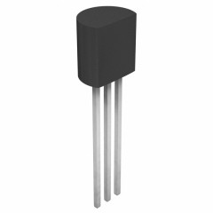
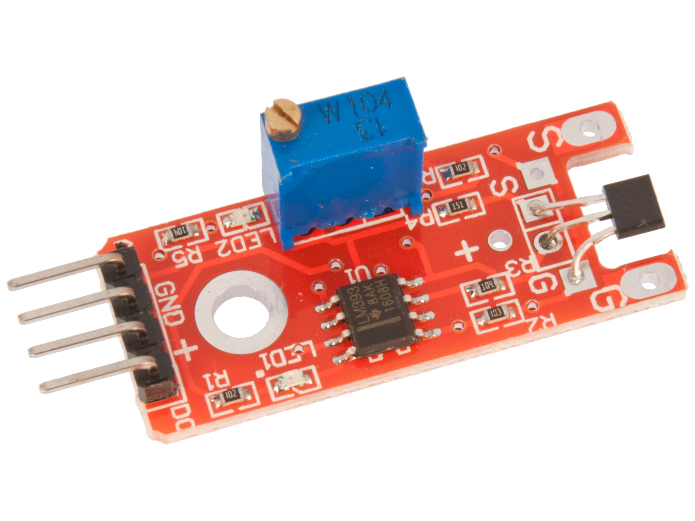

Author: Isak Salmi

ID: is223ea

# Climate Controler with MCP9700 and hall effect sensor

This is a project to measure temperature both indoor and outdoor and check a hall effect sensor if it’s needed to open or close a window depending on the temperature and the status of the window. This is not a hard project to set up  and will take around 3 hours to set up fooling this tutorial.

## Objective

This project was constructed to help monitor and be able to lower the temperature in a room without needing a AC. So, this project main purpose is to be able to naturally help to cool down a room by checking if the air outside is cooler then the air indoors.

This is not the only thing that this project can help with. One good insight this project will give is if you have a good air circulation in the room by locking at the indoor and outdoor temp and comparing then when you have the window open and closed.

## Material

The main microcontroller for this project is a Raspbrry Pi Pico WH which is a RP2040 microcontroller with 2MB flash memory that have on-board single-band 2.4 GHz wireless interface. The on-board 2.4GHz is rally important for this project. To see more information about the Raspbrry Pi Pico WH you can find it on the [datasheet](https://datasheets.raspberrypi.com/picow/pico-w-datasheet.pdf).

The sensor to measure the temperature is a MCP9700 which can measure temperature from -40 °C to +125 °C with a ±4 °C accuracy. This is a cheap sensor that is accurate enough for this project. To find more information on MCP9700 you can read it on this [MCP9700 datasheet](https://www.electrokit.com/uploads/productfile/41011/21942e-2.pdf).

To be able to check if the window is closed or open, we use a hall effect sensor and a magnet. The hall effect sensor is both a digital and an analog signal. This sensor will give a signal depending on how strong the magnetic field is near the sensor. For mor info and a user guide, lock at this [guide](https://www.electrokit.com/uploads/productfile/41015/41015710_-_Hall_Effect_Sensor.pdf). The Magnet used in this project is a [Magnet Neo 35 Ø5mm x 5mm](https://www.electrokit.com/uploads/productfile/41011/41011480.pdf).

In this project we also use a breadboard. Here you don’t need a specific breadboard. You will also be needing a micro-USB cable and jumper cables, both M- to -M and M- to -F.

|                                                                   |         Name         | price (SEK) | Amount |                                              Link                                              |
| ------------------------------------------------------------------- | :--------------------: | :-----------: | :------: | :----------------------------------------------------------------------------------------------: |
|  | Raspberry Pi Pico WH |     109     |   1   |        [Raspberry Pi Pico WH](https://www.electrokit.com/produkt/raspberry-pi-pico-wh/)        |
|  |       MCP9700       |    10.75    |   2   |   [MCP9700](https://www.electrokit.com/produkt/mcp9700-e-to-to-92-temperaturgivare/https:/)   |
| |  hall effect sensor  |     36     |   1   | [hall effect sensor](https://www.electrokit.com/produkt/pulsgivare-halleffekt-digital/https:/) |
