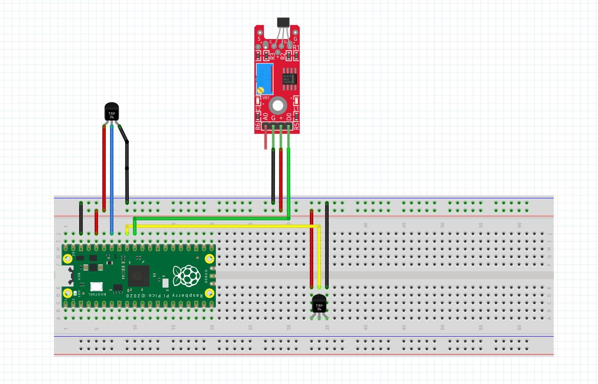

Author: Isak Salmi

ID: is223ea

# Climate Controler with MCP9700 and hall effect sensor

This is a project to measure temperature both indoor and outdoor and check a hall effect sensor if it’s needed to open or close a window depending on the temperature and the status of the window. This is not a hard project to set up  and will take around 3 hours to set up fooling this tutorial.

## Objective

This project was constructed to help monitor and be able to lower the temperature in a room without needing a AC. So, this project main purpose is to be able to naturally help to cool down a room by checking if the air outside is cooler then the air indoors.

This is not the only thing that this project can help with. One good insight this project will give is if you have a good air circulation in the room by locking at the indoor and outdoor temp and comparing then when you have the window open and closed.

## Material

The main microcontroller for this project is a Raspbrry Pi Pico WH which is a RP2040 microcontroller with 2MB flash memory that have on-board single-band 2.4 GHz wireless interface. The on-board 2.4GHz is rally important for this project. To see more information about the Raspbrry Pi Pico WH you can find it on the [datasheet](https://datasheets.raspberrypi.com/picow/pico-w-datasheet.pdf).

The sensor to measure the temperature is a MCP9700 which can measure temperature from -40 °C to +125 °C with a ±4 °C accuracy. This is a cheap sensor that is accurate enough for this project. To find more information on MCP9700 you can read it on this [MCP9700 datasheet](https://www.electrokit.com/uploads/productfile/41011/21942e-2.pdf).

To be able to check if the window is closed or open, we use a hall effect sensor and a magnet. The hall effect sensor is both a digital and an analog signal. This sensor will give a signal depending on how strong the magnetic field is near the sensor. For mor info and a user guide, lock at this [guide](https://www.electrokit.com/uploads/productfile/41015/41015710_-_Hall_Effect_Sensor.pdf). The Magnet used in this project is a [Magnet Neo 35 Ø5mm x 5mm](https://www.electrokit.com/uploads/productfile/41011/41011480.pdf).

In this project we also use a breadboard. Here you don’t need a specific breadboard. You will also be needing a micro-USB cable and jumper cables, both M- to -M and M- to -F. On the amount column in the table below is the minimum amount of jumper cables needed to do this project. The amount of M-to-F jumper cables depends on how long the cable for the outdoor temperature sensor needs to be and also how long the cable of the hall effect sesnor needs to be. In the


|                                                  |         Name         | price (SEK) | Amount |                                                Link                                                |
| -------------------------------------------------- | :---------------------: | :-----------: | :------: | :--------------------------------------------------------------------------------------------------: |
|   | Raspberry Pi Pico WH |     109     |   1   |          [Raspberry Pi Pico WH](https://www.electrokit.com/produkt/raspberry-pi-pico-wh/)          |
|        |        MCP9700        |    10.75    |   2   |     [MCP9700](https://www.electrokit.com/produkt/mcp9700-e-to-to-92-temperaturgivare/https:/)     |
|    |  hall effect sensor  |     36     |   1   |   [hall effect sensor](https://www.electrokit.com/produkt/pulsgivare-halleffekt-digital/https:/)   |
|  |      BreadBoard      |     69     |   1   |      [BreadBoard](https://www.electrokit.com/produkt/kopplingsdack-840-anslutningar/https:/)      |
|      | USB-kable A to mico B |     39     |   1   | [USB-kable A to mico B](https://www.electrokit.com/produkt/usb-kabel-a-hane-micro-b-5p-hane-1-8m/) |
|         | Jumper cables M-to-M |     29     |   16   |    [Jumper cables M-to-M](https://www.electrokit.com/produkt/labbsladd-20-pin-15cm-hane-hane/)    |
|         | Jumper cables M-to-F |     29     |   6   |    [Jumper cables M-to-F](https://www.electrokit.com/produkt/labbsladd-20-pin-15cm-hona-hane/)    |

## Computer setup

In this project we used [Visual Studio Code](https://code.visualstudio.com/https:/) and with VS code we used the [Pico-W-Go](https://marketplace.visualstudio.com/items?itemName=paulober.pico-w-gohttps:/) extension to upload the code on to our raspberry Pi Pico WH. The steps below are for windows OS, If you are using another OS there might be some other steps.

**To setup the project you need to follow this step by step:**

1. This project uses micropython so first you need to install [python](https://www.python.org/downloads/).
2. Download and install the IDE, we use the IDE [VS code
3. Get the [Pico-W-Go](https://marketplace.visualstudio.com/items?itemName=paulober.pico-w-gohttps:/) extension in VS code. To install a extention follow this [guide](https://code.visualstudio.com/docs/editor/extension-marketplace). The guide is for another extention but works the same whay for Pico-W-Go

now that we have setup the coding environment, we need to install the firmware to be able to run micropython on the pico WH. To setup and update the firmware fore the Raspberry Pi Pico WH you need to follow these steps in order:

1. First we need to download the [MicroPython firmware](https://micropython.org/download/rp2-pico-w/). When you download the firmware, you will get a u2f file witch we need later. To make sure you get a stable build I would recommend to get the Releases and not the Nightly build.
2. Connect the micro-USB to the pico WH and **not** to the computer.
3. Now you need to push in the **bootsel** button.After you have push in the button you can plug in the other end of the USB into your computer. After you have plug the USB in to the computer you can release the bootsel button. You can finde the bootsel button here:

   
4. If the steps above was done correctly you should get a new driver in you file system called **RPI-RP2** witch is the raspberry pi pico WH. Now you take the **uf2** file from earlier and drag it in to this storage.
5. After you dragged the uf2 file in to the RRI-RP2 you wait till the Pico automatically disconnect and reconnect.

Now you have successfully installed microPython on yourNow you have Raspberry Pi Pico WH. The last thing is to upload the code to the Raspberry Pi Pico WH:

1. First you need to clone this repository to your computer. You do this by first installing [Git](https://git-scm.com/downloads) on your computer. When you have install Git you can test to se if you have done everything successfully by typing `git --version` in your terminal. If you get a version of git you have done everything right.
2. Now you need to clone this repository to your computer. First go to a place in your file system where you want the project to be. Copy the path and open a terminal. Type `cd your_path` and press enter. Now you are in the directory you want the project to be.
3. Now its time to clone the project. Just type this in your `git clone https://github.com/IsakSalmi/IoT_project.git`. If done correctly you should have the project on that path.
4. Now you just connect your Pico to a USB open the project folder in VS code. You can see if you are connected to the Pico on the tollbar on the bottom. 

   After that press `CTR+shift+p` and search for Pico-W-Go: Upload project to Pico and press enter.

## Putting circut together

To create the circuit, follow this illustration to connect the two MCP9700 and the hall effect sensor. Be careful when connecting the MCP9700 so you have the right side. In the illustration the flat side is toward you. The length of the cables is not accurate to the real project because the cable length is different depending on your windows and placement of the breadboard.

<p align="center">
   
</p>

## Platform

The platform used in this project is [Adafruit](https://www.adafruit.com/) which is a free and easy to use broker. The platform is used to receive and display all the data we get from the temperature sensor and hall effect sensor so we can display it in a more user-friendly way. We will go through how to set up adafruit later in this document.

## code

The code consists of a main.py file and a lib map. In the lib map we have a config.py, mqtt.py, sensor.py and wifi.py.

In the **main.py** we have the code for both connecting to the WIFI and connecting with adafruit by using a MQTT connection.

```python
#connecting to the internet
wifi.connect()
wifi.getHttpTest()

#conecting to adafruit
AIO_CLIENT_ID = ubinascii.hexlify(machine.unique_id())
client = MQTTClient(AIO_CLIENT_ID, config.AIO_SERVER, config.AIO_PORT, config.AIO_USER, config.AIO_KEY)
client.connect()
```

We also have the main loop in **main.py**. this loop will read from all the sensors and send the right info to the adafruit by using the different send functions in main.py. We can se that we have two if statement in the main loop. This statement is to send the necessary data to know if you should open or close the window. This info can only be sent once every time the window changes from close to open or vice versa.

```python
def main():
    can_send_massage = True
    last_window_comand = False
    
    while True:
        # get all the needed variables from the sensors
        temp = sensors.MCPSensor()
        window = sensors.WinSensor()
        
        #send the window status to adafruit
        send_window_status(window)

        #if we have a change from the window sensor we can now 
        #send a new message
        if(last_window_comand != window):
            can_send_massage = True

        print("temp in: {}, temp out: {}".format(temp[0],temp[1]))
        print("window: {}, can_send_massage: {}\n".format(window, can_send_massage))
        
        #if we have a closed window, indoor temp is higer 
        #then outdoor temp and we can send a messages to adafruit to be able to 
        #call the action in adafruit
        if(((temp[0] - 1) > temp[1]) and (window == True) and (can_send_massage == True)):
            send_window_command(1)
            can_send_massage = False
            
        #the same as above but in reverse order. 
        elif(((temp[1] - 1) > temp[0]) and (window == False) and (can_send_massage == True)):
            send_window_command(0)
            can_send_massage = False
        
        #send both temp to the adafruit server 
        send_temp(temp[0],temp[1])

        last_window_comand = window
        sleep(10)
```
